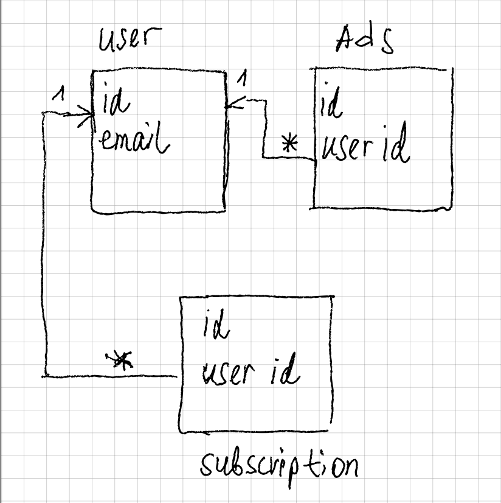

### Project overview

I am working on an API for an ads bulletin board. The board allows posting of public ads which can have an expiration date and owner's contact details. 
I am using a simple authorization to give more privileges to admin, while a normal user will have a smaller set of abilities.
For a registered user, there will be an option to have a subscription. Subscription will increase limits for ads publishing.

**User roles** :
- Admin. A user with an "admin" role should be able to create, update and delete ads created by any user. Only an admin should be able to update ads that are not their own, either active or inactive.

- Registered User. A user should be able to create, update, delete only their own ads. They can browse other's ads and get owner's contact info for active ads.

- Anonymous User. A user should be able only to view active ads and get owner's contact details.

**Subscription states** :
- Active and can be for 3, 6 or 12 months duration. Each active subscription has its start date and duration in days.
- Inactive

**Ads statuses** :
- Active
- Inactive

### Requirements

My project will require an Express API using:

- Authentication and Authorization:

    1. Login and authentication will be implemented with JWT which will be generated using the [jsonwebtoken](https://www.npmjs.com/package/jsonwebtoken) library. I will be using middleware to enforce authentication and authorization.

    2. For securely storing passwords I will be using [bcrypt](https://www.npmjs.com/package/bcrypt) library.

- CRUD routes, data models, DAOs:

    1. Using [MongoDB](https://www.mongodb.com/try/download/community) for storing data and CRUD operations.

    2. Routes for a user to sign up, login, logout, and change password. This will use a `User` model and corresponding DAO methods.

    3. Routes for `Ads` along with `Ads` model and corresponding DAO methods.

    4. Routes for `Subscription` along with `Subscription` model and corresponding DAO methods.

    - Login
        - Signup: `POST /login/signup`
        - Login: `POST /login`
        - Logout: `POST /login/logout`
        - Change Password `POST /login/password`
    - Ads 
        - Create: `POST /ads`
        - Get all ads: `GET /ads`
        - Get a single ad: `GET /ads/:id`
        - Update: `PUT /ads/:id`
        - Delete: `DELETE /ads/:id`
        - Get an ad owner contacts: `GET /ads/:id/contacts`
    - Subscription
        - Create: `POST /subscription`
        - Get all subscriptions: `GET /subscription`
        - Get a single subscription: `GET /subscription/:id`
        - Update: `PUT /subscription/:id`
        - Delete: `DELETE /subscription/:id`

- Routes will be fully tested (project test coverage > 80%).
- Postman collection to interact with API.

### Project Phases
Project proposal created. - *Completed*.

Most of the unit tests for the routes are in place. - *In progress*.

Unit tests are passing. Prototype/proof of concept is in place. - *In progress*.

Postman collection created. Start working on a presentation.

Project submission, presentation.